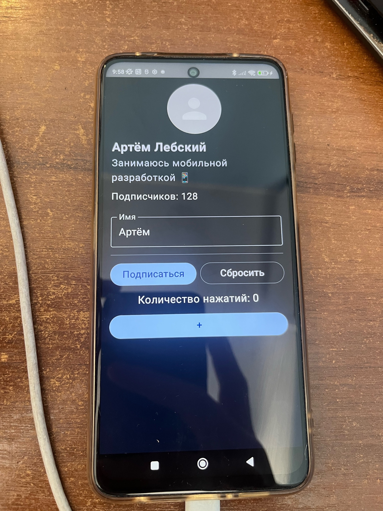

# Отчёт по лабораторной работе №3

## «Пользовательский интерфейс в Jetpack Compose. Базовые компоненты»

## Сведения о студенте

- **ФИО:** Лебский Артём Александрович
- **Группа:** Пин-б-о-24-1
- **Курс:** 3
- **Семестр:** 1
- **Дата выполнения:** 2026-10-06
- **Дисциплина:** Программирование мобильных устройств
- **ОС:** Debian (Linux)

---

## 1. ЦЕЛЬ РАБОТЫ

> 1. Освоить базовые компоненты Jetpack Compose: `Text`, `Button`, `Column`, `Row`, `Box`, `Image`, `Icon`.
> 2. Научиться использовать `Modifier` для стилизации и позиционирования элементов.
> 3. Освоить управление состоянием в Compose через `remember` и `mutableStateOf`.
> 4. Создать адаптивный экран профиля пользователя с интерактивными элементами.
> 5. Подготовить проект к дальнейшей интеграции с архитектурой MVVM (следующая ЛР).

---

## 2. ЗАДАЧИ РАБОТЫ

**Выполнены следующие задачи:**

> 1. Создан новый Android-проект с шаблоном **Empty Activity** и поддержкой Compose.
> 2. Изучена структура Compose-проекта: `MainActivity.kt`, `ui/theme/`, пакеты компонентов.
> 3. Создан статический макет экрана профиля: аватар, имя, фамилия, статус, кнопки.
> 4. Добавлены `Modifier` для стилизации: `padding`, `size`, `clip`, `background`, выравнивание.
> 5. Добавлен разделитель `HorizontalDivider` между информацией и кнопками.
> 6. Реализована кнопка «Подписаться» / «Отписаться» с использованием `remember` и `mutableStateOf`.
> 7. Реализован счётчик нажатий с кнопкой «+» и отображением текущего значения.
> 8. Добавлено поле ввода `OutlinedTextField` для редактирования имени.
> 9. Добавлена кнопка «Сбросить», возвращающая имя к значению по умолчанию.
> 10. Добавлены `@Preview` для всех Composable-функций.
> 11. Реализовано динамическое изменение количества подписчиков при подписке/отписке.
> 12. Выполнена сборка проекта и запуск на реальном устройстве Xiaomi Redmi Note 9 Pro.

---

## 3. ХОД ВЫПОЛНЕНИЯ РАБОТЫ

### 3.1. Создание проекта

Создан новый Android-проект с шаблоном **Empty Activity** и поддержкой Jetpack Compose. Проект назван `lr3`. Структура пакетов:

```text
com.example.lr3/
├── MainActivity.kt
├── data/
│   └── User.kt
└── ui/
    ├── ProfileScreen.kt
    ├── components/
    │   ├── Avatar.kt
    │   ├── ProfileInfo.kt
    │   └── ActionButtons.kt
    └── theme/
        ├── Color.kt
        ├── Theme.kt
        └── Type.kt
```

### 3.2. Создание data-класса User

Создан data-класс `User`, содержащий информацию о пользователе:

```kotlin
package com.example.lr3.data

data class User(
    val name: String = "Артём",
    val surname: String = "Лебский",
    val status: String = "Занимаюсь мобильной разработкой 📱",
    val followers: Int = 128,
    val isSubscribed: Boolean = false
)
```

**Результат:** Модель данных готова к использованию в UI-компонентах.

### 3.3. Создание компонента Avatar

Компонент `Avatar` реализован в виде круглой иконки `Icons.Default.Person` с размером 120 dp:

```kotlin
@Composable
fun Avatar(modifier: Modifier = Modifier) {
    Box(
        modifier = modifier
            .size(120.dp)
            .clip(CircleShape)
            .background(Color.LightGray),
        contentAlignment = Alignment.Center
    ) {
        Icon(
            imageVector = Icons.Default.Person,
            contentDescription = "Аватар пользователя",
            modifier = Modifier.size(80.dp),
            tint = Color.White
        )
    }
}
```

**Результат:** Аватар корректно отображается в виде круглой иконки.

### 3.4. Создание компонента ProfileInfo

Компонент `ProfileInfo` отображает имя, фамилию, статус и количество подписчиков:

```kotlin
@Composable
fun ProfileInfo(
    user: User,
    modifier: Modifier = Modifier
) {
    Column(modifier = modifier) {
        Text(
            text = "${user.name} ${user.surname}",
            fontSize = 24.sp,
            fontWeight = FontWeight.Bold
        )
        Spacer(modifier = Modifier.height(4.dp))
        Text(
            text = user.status,
            fontSize = 16.sp,
            color = MaterialTheme.colorScheme.secondary
        )
        Spacer(modifier = Modifier.height(8.dp))
        Text(
            text = "Подписчиков: ${user.followers}",
            fontSize = 14.sp
        )
    }
}
```

**Результат:** Информация о пользователе отображается корректно с нужными размерами шрифтов.

### 3.5. Создание компонента ActionButtons

Компонент `ActionButtons` содержит кнопки «Подписаться»/«Отписаться» и «Сбросить»:

```kotlin
@Composable
fun ActionButtons(
    isSubscribed: Boolean,
    onSubscribeClick: () -> Unit,
    onResetClick: () -> Unit,
    modifier: Modifier = Modifier
) {
    Row(
        modifier = modifier.fillMaxWidth(),
        horizontalArrangement = Arrangement.spacedBy(8.dp)
    ) {
        Button(
            onClick = onSubscribeClick,
            modifier = Modifier.weight(1f),
            colors = ButtonDefaults.buttonColors(
                containerColor = if (isSubscribed)
                    MaterialTheme.colorScheme.secondary
                else
                    MaterialTheme.colorScheme.primary
            )
        ) {
            Text(text = if (isSubscribed) "Отписаться" else "Подписаться")
        }

        OutlinedButton(
            onClick = onResetClick,
            modifier = Modifier.weight(1f)
        ) {
            Text(text = "Сбросить")
        }
    }
}
```

**Результат:** Кнопки корректно расположены в ряд, цвет кнопки подписки меняется в зависимости от состояния.

### 3.6. Создание основного экрана ProfileScreen

`ProfileScreen` объединяет все компоненты и управляет состоянием экрана:

```kotlin
@Composable
fun ProfileScreen(
    user: User = User(),
    modifier: Modifier = Modifier
) {
    var name by remember { mutableStateOf(user.name) }
    val surname = user.surname
    var isSubscribed by remember { mutableStateOf(user.isSubscribed) }
    var followers by remember { mutableStateOf(user.followers) }
    var clickCount by remember { mutableStateOf(0) }

    Column(
        modifier = modifier
            .fillMaxSize()
            .padding(16.dp),
        horizontalAlignment = Alignment.CenterHorizontally,
        verticalArrangement = Arrangement.spacedBy(16.dp)
    ) {
        Avatar()
        ProfileInfo(user = user.copy(name = name, surname = surname, followers = followers))

        OutlinedTextField(
            value = name,
            onValueChange = { name = it },
            label = { Text("Имя") },
            modifier = Modifier.fillMaxWidth()
        )

        HorizontalDivider()

        ActionButtons(
            isSubscribed = isSubscribed,
            onSubscribeClick = {
                isSubscribed = !isSubscribed
                followers += if (isSubscribed) 1 else -1
            },
            onResetClick = {
                name = user.name
            }
        )

        Text(text = "Количество нажатий: $clickCount")

        Button(
            onClick = { clickCount++ },
            modifier = Modifier.fillMaxWidth()
        ) {
            Text(text = "+")
        }
    }
}
```

**Результат:** Основной экран собирает все компоненты, состояние имени, подписки, подписчиков и счётчика нажатий управляется через `remember` и `mutableStateOf`.

### 3.7. Настройка MainActivity

```kotlin
class MainActivity : ComponentActivity() {
    override fun onCreate(savedInstanceState: Bundle?) {
        super.onCreate(savedInstanceState)
        setContent {
            Lr3Theme {
                Surface(
                    modifier = Modifier.fillMaxSize(),
                    color = MaterialTheme.colorScheme.background
                ) {
                    ProfileScreen()
                }
            }
        }
    }
}
```

**Результат:** Точка входа приложения корректно отображает `ProfileScreen`.

### 3.8. Добавление @Preview

Для каждой Composable-функции добавлена аннотация `@Preview`:

```kotlin
@Preview(showBackground = true)
@Composable
fun AvatarPreview() {
    Lr3Theme {
        Avatar()
    }
}
```

**Результат:** Предпросмотр работает для всех компонентов.

### 3.9. Сборка и запуск

Выполнена сборка проекта:

```bash
Build → Make Project
```

Результат: **BUILD SUCCESSFUL in 4s**.

Приложение запущено на реальном устройстве **Xiaomi Redmi Note 9 Pro**:


```text
---------------------------- PROCESS STARTED for package com.example.lr3 ----------------------------
09:58 — приложение успешно запущено
```

**Результат:** Экран профиля отображается корректно: аватар, имя «Артём Лебский», статус, количество подписчиков, поле ввода имени, кнопки «Подписаться»/«Сбросить», счётчик нажатий и кнопка «+».

---

## 4. ОТВЕТЫ НА КОНТРОЛЬНЫЕ ВОПРОСЫ

### 1. Что такое Jetpack Compose и в чём его отличие от XML-вёрстки?

Jetpack Compose — это современный декларативный UI-фреймворк для Android, написанный на Kotlin. В отличие от XML-вёрстки, где интерфейс описывается в разметке, а логика — в коде, Compose позволяет описывать UI и логику в одном месте на языке Kotlin. Это упрощает создание динамических интерфейсов и уменьшает количество шаблонного кода.

### 2. Что такое @Composable-функция?

`@Composable` — это аннотация, которая помечает функцию как компонент UI. Такие функции могут вызываться только из других `@Composable`-функций. Они описывают, как должен выглядеть интерфейс, и автоматически перерисовываются при изменении состояния.

### 3. Что такое Modifier и приведите примеры его использования.

`Modifier` — это объект, который определяет, как компонент должен быть оформлен и расположен. Примеры:
- `Modifier.size(120.dp)` — задаёт размер.
- `Modifier.padding(16.dp)` — добавляет отступы.
- `Modifier.clip(CircleShape)` — обрезает компонент по кругу.
- `Modifier.background(Color.LightGray)` — задаёт фон.

### 4. Как управлять состоянием в Compose? Что такое remember?

Состояние в Compose управляется через `remember` и `mutableStateOf`. `remember` сохраняет значение между рекомпозициями, а `mutableStateOf` создаёт наблюдаемое состояние. При изменении состояния UI автоматически перерисовывается.

### 5. Как работает рекомпозиция в Compose?

Рекомпозиция — это процесс повторного вызова `@Composable`-функций при изменении состояния. Compose отслеживает, какие компоненты зависят от изменённого состояния, и перерисовывает только их, что повышает производительность.

### 6. В чём разница между Column и Row?

`Column` располагает элементы вертикально, а `Row` — горизонтально. Оба контейнера поддерживают выравнивание и отступы через `horizontalAlignment`, `verticalArrangement` и `Arrangement.spacedBy()`.

### 7. Как использовать TextField в Compose?

`TextField` (или `OutlinedTextField`) используется для ввода текста. Основные параметры: `value` — текущее значение, `onValueChange` — обработчик изменения. Состояние управляется через `remember` и `mutableStateOf`.

### 8. Что такое Divider и для чего он нужен?

`Divider` (в новых версиях `HorizontalDivider`) — это визуальный разделитель между элементами. Он помогает структурировать интерфейс и отделять логические блоки.

### 9. Для чего нужна аннотация @Preview?

`@Preview` позволяет просматривать Composable-функции прямо в Android Studio без запуска приложения на устройстве. Это ускоряет разработку и отладку UI.

### 10. Как вынести повторяющийся код в отдельный компонент?

Нужно создать отдельную `@Composable`-функцию, принимающую нужные параметры (например, `modifier` и данные), и вызывать её из других компонентов. Это улучшает читаемость и переиспользуемость кода.

---

## 5. ИСПОЛЬЗУЕМЫЕ КОМАНДЫ

```bash
# Сборка проекта
Build → Make Project

# Запуск приложения
Run → Run 'app'

# Очистка и пересборка
Build → Clean Project
Build → Rebuild Project
```

---

## 6. ВЫВОДЫ

В ходе выполнения лабораторной работы были изучены и отработаны практические навыки создания пользовательского интерфейса в Jetpack Compose:

> 1. Освоены базовые компоненты Compose: `Text`, `Button`, `Column`, `Row`, `Box`, `Icon`, `OutlinedTextField`, `HorizontalDivider`.
> 2. Изучены принципы работы `Modifier` для стилизации и позиционирования элементов.
> 3. Освоено управление состоянием через `remember` и `mutableStateOf`.
> 4. Реализован интерактивный экран профиля пользователя с редактированием имени, подпиской, счётчиком нажатий и кнопкой сброса.
> 5. Изучены принципы рекомпозиции и автоматического обновления UI при изменении состояния.
> 6. Отработаны навыки разбивки UI на переиспользуемые компоненты.
> 7. Получен практический опыт сборки и запуска приложения на реальном устройстве.
> 8. Проект подготовлен к дальнейшей интеграции с архитектурой MVVM (следующая ЛР).

---
